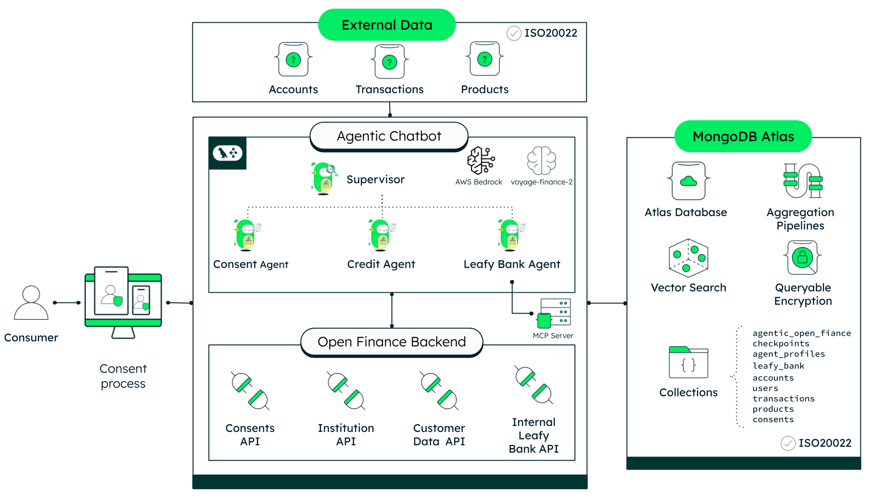

# Open Finance Next Gen

Demonstrates how MongoDB Atlas powers secure Open Finance data exchange — consent management with Queryable Encryption, dual-database architecture for internal and external bank data, and Atlas Vector Search for real-time transaction classification.

> **This is one of three interconnected repositories that make up the Leafy Bank Open Finance solution:**
>
> | Repository | Description | Port |
> |------------|-------------|------|
> | **open-finance-next-gen** (this repo) | FastAPI backend — consents, accounts, transactions, Queryable Encryption | 8003 |
> | [leafy-bank-backend-openfinance-reactagent-chatbot](https://github.com/mongodb-industry-solutions/leafy-bank-backend-openfinance-reactagent-chatbot) | LangGraph multi-agent chatbot — consent flows, portability analysis, financial advice | 8080 |
> | [open-finance-next-gen-ui](https://github.com/mongodb-industry-solutions/open-finance-next-gen-ui) | Next.js 15 frontend — dashboard, multi-bank views, AI assistant | 3000 |

## Where MongoDB Shines

- **Queryable Encryption for Consent Privacy**: Sensitive consent fields (consumer identity, permissions, source institution) are encrypted at rest and in transit. MongoDB's Queryable Encryption enables equality queries on encrypted fields without ever exposing plaintext to the server — critical for regulatory compliance in financial services.
- **Dual-Database Architecture**: Two databases with distinct purposes — `open_finance` for external bank data, tokens, and encrypted consents; `leafy_bank` for internal accounts, transactions, and products. MongoDB's flexible document model handles both ISO 20022-aligned external formats and flat internal schemas without migration friction.
- **Atlas Vector Search for Transaction Classification**: Untagged transactions from external banks are semantically classified against MCC reference codes using Atlas Vector Search (1024-dim Voyage AI embeddings, cosine similarity) — no external search infrastructure required.
- **Aggregation Pipelines for Financial Calculations**: MongoDB aggregation pipelines compute total balances, debt positions, and product comparisons across internal and external accounts in a single database operation.

## High-Level Architecture



## Tech Stack

- **[MongoDB Atlas](https://www.mongodb.com/atlas)** for the dual-database data layer (external + internal bank data)
- **[MongoDB Queryable Encryption](https://www.mongodb.com/docs/manual/core/queryable-encryption/)** for encrypted consent storage with searchable fields
- **[MongoDB Atlas Vector Search](https://www.mongodb.com/docs/atlas/atlas-vector-search/)** for semantic transaction classification via MCC codes
- **[FastAPI](https://fastapi.tiangolo.com/)** (Python) for the REST API backend
- **[SlowAPI](https://slowapi.readthedocs.io/)** for rate limiting (60 requests/minute)
- **[Voyage AI](https://www.voyageai.com/)** (`voyage-finance-2` model) for 1024-dim financial embeddings
- **[Poetry](https://python-poetry.org/)** for Python dependency management

## Prerequisites

Before you begin, ensure you have met the following requirements:

- **Python** 3.10 or higher (but less than 4.0)
- **Poetry** 1.8.4 (install via [Poetry's official docs](https://python-poetry.org/docs/#installation) or `pipx install poetry==1.8.4`)
- **MongoDB Atlas** cluster with Queryable Encryption support
- **Voyage AI API key** for MCC embedding generation (get one at [Voyage AI's dashboard](https://dash.voyageai.com/api-keys))
- **Docker & Docker Compose** (optional, for containerized deployment)

## Initial Configuration

### Obtain Your MongoDB Connection String

1. Set up a [MongoDB Atlas](https://www.mongodb.com/atlas) cluster if you don't have one already.
2. Locate your cluster, click **Connect**, and select **Connect your application**.
3. Copy the connection string.

> You'll need this connection string for the `MONGODB_URI` environment variable.

### Clone the Repository

1. Open your terminal and navigate to the directory where you want to store the project:

   ```bash
   cd /path/to/your/desired/directory
   ```

2. Clone the repository:

   ```bash
   git clone <repository-url>
   ```

3. Navigate into the cloned project:

   ```bash
   cd open-finance-next-gen
   ```

### Set Up Queryable Encryption

Queryable Encryption requires a local master key and an encrypted consents collection with Data Encryption Keys (DEKs).

1. Generate a 96-byte local master key:

   ```bash
   python -c "import os; open('backend/master-key.bin', 'wb').write(os.urandom(96))"
   ```

2. Run the encrypted consents setup script:

   ```bash
   cd backend && poetry run python ../scripts/setup_encrypted_consents.py
   ```

   This creates the `encrypted_consents` collection, generates 4 DEKs, and saves `encryption_config.json` (gitignored).

> For production, replace the local master key with AWS KMS. Never commit `master-key.bin` or `encryption_config.json` to version control.

### Populate Seed Data

The demo requires seed data across two databases. Import the following collections into your Atlas cluster:

**Database: `open_finance_test`**

| Collection                         | Purpose                                          |
| ---------------------------------- | ------------------------------------------------ |
| `tokens`                           | Bearer token storage                             |
| `institutions`                     | Available external banks                         |
| `encrypted_consents`               | Queryable Encrypted consent records              |
| `external_accounts`                | Account data from external institutions          |
| `external_products`                | Loans/credit products from external banks        |
| `external_transactions_test`       | ISO 20022-aligned transaction data               |
| `external_repayment_history`       | Repayment data for portability                   |
| `external_customer_identification` | Customer identity matching                       |

**Database: `leafy_bank_test`**

| Collection                | Purpose                                       |
| ------------------------- | --------------------------------------------- |
| `accounts`                | Internal bank accounts                        |
| `users`                   | Internal bank users                           |
| `internal_transactions`   | ISO 20022-aligned internal transaction history |
| `products`                | Leafy Bank loan/credit products               |
| `customers`               | Customer credit information                   |
| `credit_bureau_scores`    | User credit scores                            |
| `mcc_codes`               | MCC reference codes with vector embeddings    |
| `spending_best_practices` | MCC code ranges and spending category targets |
| `portability_rules`       | Underwriting rules for loan portability       |

### Seed Spending Profiles

The demo supports three spending profiles (overspender, balanced, saver) for two demo users. Seed them with:

```bash
cd backend && poetry run python ../scripts/seed_profiles.py
```

This loads 90 profile-tagged transactions into `external_transactions_test`.

### Seed MCC Codes with Embeddings

The MCC classification feature requires vector embeddings. Seed them with:

```bash
cd backend && poetry run python ../scripts/seed_mcc_codes.py
```

This embeds 48 MCC reference codes using Voyage AI's `voyage-finance-2` model and inserts them into `leafy_bank_test.mcc_codes`.

> Requires `VOYAGE_API_KEY` in your `.env` file.

### Create Atlas Vector Search Index

The MCC classification service requires an Atlas Vector Search index on the `mcc_codes` collection.

**Index name:** `mcc_codes_vector_index`

```json
{
  "fields": [
    {
      "type": "vector",
      "path": "embedding",
      "numDimensions": 1024,
      "similarity": "cosine"
    }
  ]
}
```

#### How to Create the Index

1. Go to [Atlas](https://cloud.mongodb.com/) and select your cluster.
2. Click **Atlas Search** in the left sidebar.
3. Click **Create Search Index**.
4. Select **Atlas Vector Search** as the index type, then click **Next**.
5. Choose the **JSON Editor** for the configuration method.
6. Select the `mcc_codes` collection in the `leafy_bank_test` database.
7. Set the **Index Name** to `mcc_codes_vector_index`.
8. Replace the default definition with the JSON above.
9. Click **Next**, review, then click **Create Search Index**.

> The index takes a few seconds to build. Wait until the status shows **Active** before running the demo.

## Run it Locally

### Setup

1. (Optional) Set your project description and author information in `backend/pyproject.toml`:

   ```toml
   description = "Your Description"
   authors = [{name = "Your Name", email = "you@example.com"}]
   ```

2. Ensure you are in the root project directory where the `makefile` is located.

3. Run the setup commands:

   ```bash
   make setup
   ```

   This configures Poetry for in-project virtual environments and installs all dependencies. Verify that the `.venv` folder has been generated within the `backend/` directory.

4. Create a `backend/.env` file with your configuration:

   ```bash
   # MongoDB
   MONGODB_URI=
   OPENFINANCE_DB_NAME=open_finance_test
   LEAFYBANK_DB_NAME=leafy_bank_test

   # Voyage AI (for MCC embeddings)
   VOYAGE_API_KEY=
   ```

### Running Locally

Start the development server with:

```bash
make dev
```

- **API**: <http://localhost:8003>
- **Swagger Docs**: <http://localhost:8003/docs>
- **ReDoc**: <http://localhost:8003/redoc>

You can also run with different verbosity levels:

```bash
make run            # Production mode (no reload)
make run-verbose    # Debug logging
make logs           # Trace logging (most verbose)
```

**Quick health check:**

```bash
make check          # Verify app imports correctly
```

## Run with Docker

Make sure to run this from the root directory.

To run with Docker:

```bash
make build
```

The API will be available at <http://localhost:8080>.

To manage the container:

```bash
make start    # Start existing container
make stop     # Stop container
make clean    # Remove container and images
```

> **Note:** The Docker container runs on port 8080, while local development runs on port 8003.

## API Endpoints

### Authentication

| Method | Path                                           | Auth   | Purpose                     |
| ------ | ---------------------------------------------- | ------ | --------------------------- |
| `GET`  | `/api/v1/openfinance/public/get-authorization` | None   | Get bearer token for a user |
| `POST` | `/api/v1/openfinance/public/create-user`       | None   | Create a new user and token |
| `POST` | `/api/v1/openfinance/secure/validate-token`    | Bearer | Validate token health       |

### Consent Management (Queryable Encrypted)

| Method   | Path                                                      | Purpose                                 |
| -------- | --------------------------------------------------------- | --------------------------------------- |
| `POST`   | `/api/v1/openfinance/secure/consents`                     | Create consent (AWAITING_AUTHORISATION) |
| `GET`    | `/api/v1/openfinance/secure/consents/{consent_id}`        | Retrieve consent by ID                  |
| `PATCH`  | `/api/v1/openfinance/secure/consents/{consent_id}/status` | Approve or reject consent               |
| `DELETE` | `/api/v1/openfinance/secure/consents/{consent_id}`        | Revoke consent                          |
| `GET`    | `/api/v1/openfinance/secure/consents`                     | List consents for a user                |

### Consent-Gated Data Retrieval

| Method | Path                                                                | Purpose                                   |
| ------ | ------------------------------------------------------------------- | ----------------------------------------- |
| `GET`  | `/api/v1/openfinance/secure/customers/{user}/external-data`         | All external data (requires `consent_id`) |
| `GET`  | `/api/v1/openfinance/secure/customers/{user}/external-transactions` | Transactions only (requires `consent_id`) |

### Institutions

| Method | Path                                      | Purpose                       |
| ------ | ----------------------------------------- | ----------------------------- |
| `GET`  | `/api/v1/openfinance/secure/institutions` | List available external banks |

### External Data (Institution-Scoped)

| Method | Path                                                                          | Purpose           |
| ------ | ----------------------------------------------------------------------------- | ----------------- |
| `GET`  | `/api/v1/openfinance/secure/fetch-external-accounts-for-user-and-institution` | External accounts |
| `GET`  | `/api/v1/openfinance/secure/fetch-external-products-for-user-and-institution` | External products |

### Leafy Bank Internal

| Method | Path                                                                     | Purpose                          |
| ------ | ------------------------------------------------------------------------ | -------------------------------- |
| `GET`  | `/api/v1/leafybank/accounts/secure/fetch-accounts-for-user`              | Internal accounts                |
| `GET`  | `/api/v1/leafybank/transactions/secure/get-transactions-for-user/{user}` | Internal transactions            |
| `GET`  | `/api/v1/leafybank/transactions/secure/spending/{user}`                  | All spending transactions        |
| `GET`  | `/api/v1/leafybank/customers/{user}/identification`                      | Customer identification          |
| `GET`  | `/api/v1/leafybank/customers/{user}/repayment-history`                   | Repayment data                   |
| `GET`  | `/api/v1/leafybank/customers/{user}/credit-score`                        | Credit bureau score              |
| `GET`  | `/api/v1/leafybank/products/secure/match`                                | Match loan products              |
| `GET`  | `/api/v1/leafybank/spending/best-practices`                              | Spending category reference      |
| `GET`  | `/api/v1/leafybank/portability/rules`                                    | Underwriting rules               |
| `POST` | `/api/v1/leafybank/mcc/classify`                                         | Vector Search MCC classification |

### Demo & Debug

| Method | Path                                           | Purpose                                    |
| ------ | ---------------------------------------------- | ------------------------------------------ |
| `GET`  | `/api/v1/demo/profiles`                        | Available spending profiles and demo users |
| `GET`  | `/api/v1/encryption-demo/compare/{consent_id}` | QE decrypted vs raw binary comparison      |

## Core Capabilities

### Consent State Machine

<!-- TODO: Add consent state machine diagram -->


Every consent follows a strict lifecycle:

```text
AWAITING_AUTHORISATION → AUTHORISED → CONSUMED
                       → REJECTED
AUTHORISED → REVOKED
```

- **Create** — Consent starts as `AWAITING_AUTHORISATION` with encrypted fields
- **Approve** — Transitions to `AUTHORISED` (requires explicit user action)
- **Consume** — First data retrieval transitions to `CONSUMED` (one-time consents)
- **Reject/Revoke** — Terminal states that block further data access
- **Expiration** — Enforced at application level (TTL indexes incompatible with QE)

### Queryable Encryption

<!-- TODO: Add queryable encryption diagram -->


Four consent fields are encrypted using MongoDB's Queryable Encryption:

| Field                               | Query Type            | Purpose                      |
| ----------------------------------- | --------------------- | ---------------------------- |
| `Consumer.UserName`                 | Equality              | Look up consents by user     |
| `Consumer.UserId`                   | Equality              | Look up consents by ID       |
| `Permissions`                       | None (encrypted only) | Protect permission details   |
| `SourceInstitution.InstitutionName` | None (encrypted only) | Protect institution identity |

The driver encrypts on write and decrypts on read — the Atlas server never sees plaintext. A local 96-byte master key protects the Data Encryption Keys (swap to AWS KMS for production).

### MCC Transaction Classification

<!-- TODO: Add vector search classification diagram -->


External bank transactions often lack spending categories. The MCC classification service:

1. Takes a batch of untagged transactions
2. Embeds each transaction description with Voyage AI (`voyage-finance-2`, query mode)
3. Runs Atlas Vector Search against 48 MCC reference codes (document mode embeddings)
4. Returns the best-matching category for each transaction

Results are ephemeral (not persisted) — classification happens on demand.

### Spending Profiles

Three demo profiles simulate different spending behaviors:

| Profile       | Description                                |
| ------------- | ------------------------------------------ |
| `overspender` | Excessive spending across categories       |
| `balanced`    | Healthy spending within recommended ranges |
| `saver`       | Conservative spending, well below targets  |

Profiles are baked into the database as tagged transactions. At query time, the service filters with `$or: [{Profile: {$exists: false}}, {Profile: selected_profile}]` — no load/clear mechanism needed.

## Common Errors

### Backend Errors

- **`Command not found: uvicorn`** — Run `make setup` to install dependencies.
- **`Address already in use`** — Kill the existing process: `lsof -ti :8003 | xargs kill -9`.
- **MongoDB connection failures** — Check that your `MONGODB_URI` is correct and your Atlas cluster is accessible.
- **Queryable Encryption errors** — Ensure `master-key.bin` exists and `encryption_config.json` was generated by the setup script.
- **Vector Search returns no results** — Verify the `mcc_codes_vector_index` is **Active** in Atlas and the `mcc_codes` collection has been seeded.

### Consent Errors

- **403 on data retrieval** — The consent may be expired, consumed, or revoked. Check consent status first.
- **Encryption setup fails** — The `encrypted_consents` collection may already exist. Drop it and re-run `setup_encrypted_consents.py`.
- **TTL index error** — TTL indexes are not supported on QE-encrypted collections. Expiration is enforced in application code.

### Seeding Errors

- **`VOYAGE_API_KEY` not set** — Add your Voyage AI key to `backend/.env` before running `seed_mcc_codes.py`.
- **Profile seed script fails** — Ensure you have write access to the `open_finance_test` database.

## External Consumers

This API serves as the backend for:

- **[Agentic Chatbot](../leafy-bank-backend-openfinance-react-agent-chatbot/)** — Multi-agent LangGraph chatbot that calls this API for consent management, institution lookups, and external bank data retrieval. Runs on port 8080, connects to this service on port 8003.

## Additional Resources

### MongoDB Resources

- [MongoDB for Financial Services](https://www.mongodb.com/solutions/industries/financial-services)
- [MongoDB Atlas](https://www.mongodb.com/atlas)
- [MongoDB Queryable Encryption](https://www.mongodb.com/docs/manual/core/queryable-encryption/)
- [MongoDB Atlas Vector Search](https://www.mongodb.com/docs/atlas/atlas-vector-search/)
- [MongoDB Aggregation Pipelines](https://www.mongodb.com/docs/manual/aggregation/)

### Frameworks and Services

- [FastAPI](https://fastapi.tiangolo.com/) — Python async API framework
- [SlowAPI](https://slowapi.readthedocs.io/) — Rate limiting for FastAPI
- [Voyage AI](https://www.voyageai.com/) — Financial embedding generation
- [Poetry](https://python-poetry.org/) — Python dependency management
